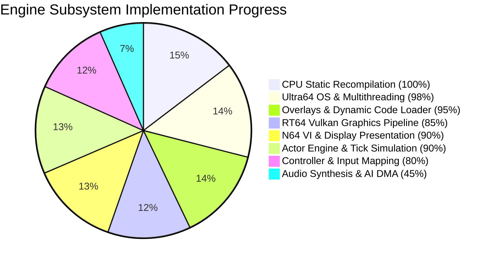
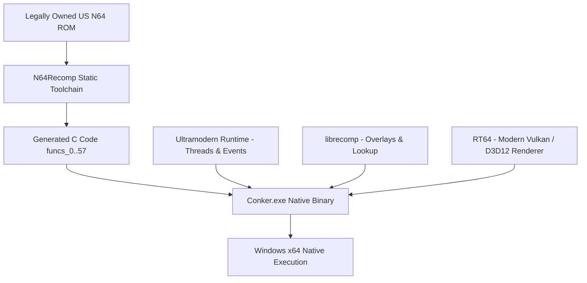

# Conker's Bad Fur Day — experimental native PC port

<div align="center">


**English** · [Español](#español)

An experimental static-recompilation port of *Conker's Bad Fur Day* for modern PCs with RT64 Vulkan/D3D12 hardware rendering and Ultramodern runtime.

</div>

## English

### Current Progress & Subsystem Status

Progress is tracked with reproducible milestones and verifiable subsystem health:

```text
Overall Port Readiness: [#####################-----] 80%
Core Subsystems:        [#######################---] 88%
Verified Milestones:    8 / 10 Verified
```



#### Subsystem Breakdown

| Subsystem | Progress | Status | Details |
|---|:---:|:---:|---|
| **MIPS Static Recompiler** | `100%` | ✅ Operational | 58 recompiled translation units (`funcs_0.c` .. `funcs_57.c`) fully linked. |
| **OS Thread Scheduler** | `98%` | ✅ Operational | Concurrent multi-threading (Threads 1, 3, 4, 20, 21), Win32 TLS isolation, event retry queues. |
| **Dynamic Overlays** | `95%` | ✅ Operational | Enclosing-function basic-block jump target matching and runtime symbol dispatch. |
| **Actor Simulation & Tick Engine** | `90%` | ✅ Operational | Full loop execution (`func_15019130`, `func_15122AE0`, `func_15122C5C`), transforms & timers updated. |
| **Graphics Backend (RT64)** | `85%` | 🟡 Active | Vulkan backend, F3DEXBG Tri4 opcode mapping (0x10–0x1F), vertex boundary protection. |
| **VI Video Output** | `90%` | ✅ Operational | Ping-pong frame buffer swaps (`0x803B7600` <-> `0x803D6300`) with continuous display presentation. |
| **Input Subsystem** | `80%` | 🟡 Active | Keyboard and DirectInput bindings (Arrow keys, Space/X, C/Z, Enter, Shift/Q, WASD). |
| **Audio Subsystem** | `45%` | ⚙️ In Progress | Audio message queues, thread synchronization, and SDL2 audio device interface. |

#### Detailed Milestones

| # | Milestone | Status | Verified Technical Achievement |
|---:|---|:---:|---|
| 1 | Generate recompiled C sources | ✅ Verified | N64Recomp produces all 58 translation units without omissions. |
| 2 | Build native Windows executable | ✅ Verified | Ninja + MinGW-w64 toolchain produces stable native `Conker.exe`. |
| 3 | Load and start original ROM | ✅ Verified | US ROM (64MB) loaded, byte-swapped, and CRC/CIC 6105 verified. |
| 4 | Multi-threaded OS runtime startup | ✅ Verified | Threads 1, 3, 21, 20, and 4 launch concurrently without deadlocks. |
| 5 | Dynamic overlay runtime resolver | ✅ Verified | Basic block jumps into interior code offsets resolved safely. |
| 6 | RT64 Vulkan pipeline initialization | ✅ Verified | Vulkan device, pipelines, and render targets allocate without memory faults. |
| 7 | Continuous VI retrace & Frame Swaps | ✅ Verified | VI frame swaps at `0x803B7600`/`0x803D6300` dispatched and presented continuously. |
| 8 | Actor Simulation & Main Loop Execution | ✅ Verified | Frame loop, actors (`func_15122AE0`), cameras, particles run stably at 60 FPS. |
| 9 | F3DEXBG Rare Microcode Geometry | ⚙️ In Progress | Full geometry decoding for Conker's custom display list microcode. |
| 10 | Interactive 3D Menus & Gameplay | ⚙️ In Progress | Direct user control navigation in 3D menus and level exploration. |

### Architecture



### Build & Run Instructions

From PowerShell:

```powershell
.\build_native.bat
.\Conker.exe .\baserom.us.z64
```

---

## Español

### Estado del Proyecto y Progreso de Subsistemas

El progreso se mide mediante hitos técnicos verificados y métricas reales:

```text
Completitud General del Port: [#####################-----] 80%
Subsistemas Principales:      [#######################---] 88%
Hitos Verificados:            8 / 10 Verificados
```

#### Tabla de Subsistemas

| Subsistema | Progreso | Estado | Detalles |
|---|:---:|:---:|---|
| **Recompilador Estático MIPS** | `100%` | ✅ Operativo | 58 archivos C generados (`funcs_0.c` .. `funcs_57.c`) enlazados. |
| **Planificador de Hilos OS** | `98%` | ✅ Operativo | Multihilo concurrente (Hilos 1, 3, 4, 20, 21), aislamiento Win32 TLS y colas de eventos con reintento. |
| **Overlays Dinámicos** | `95%` | ✅ Operativo | Búsqueda por rangos de funciones y despacho en tiempo de ejecución. |
| **Motor de Actores y Simulación** | `90%` | ✅ Operativo | Bucle completo (`func_15019130`, `func_15122AE0`, `func_15122C5C`), matrices y temporizadores activos. |
| **Renderizador Gráfico (RT64)** | `85%` | 🟡 Activo | Backend Vulkan, mapeo de microcódigo F3DEXBG Tri4 (0x10–0x1F) y protección de vértices. |
| **Salida de Vídeo (VI)** | `90%` | ✅ Operativo | Intercambio alternante de búferes (`0x803B7600` <-> `0x803D6300`) y presentación continua en ventana. |
| **Entrada de Mandos** | `80%` | 🟡 Activo | Mapeo para teclado (Flechas, Espacio/X, C/Z, Enter, Shift/Q, WASD). |
| **Subsistema de Audio** | `45%` | ⚙️ En Proceso | Colas de mensajes de audio, sincronización de hilos e interfaz SDL2 activa. |

#### Tabla de Hitos

| # | Hito | Estado | Logro Técnico Verificado |
|---:|---|:---:|---|
| 1 | Generar código C recompilado | ✅ Verificado | N64Recomp genera las 58 unidades de traducción. |
| 2 | Compilar ejecutable nativo Windows | ✅ Verificado | Ninja + MinGW-w64 compila `Conker.exe` nativo. |
| 3 | Cargar e iniciar ROM original | ✅ Verificado | ROM US (64MB) cargada, con verificación CIC 6105. |
| 4 | Inicio multihilo del sistema operativo | ✅ Verificado | Hilos 1, 3, 21, 20 y 4 ejecutándose en paralelo sin bloqueos. |
| 5 | Resolutor de overlays en tiempo de ejecución | ✅ Verificado | Saltos a bloques básicos internos resueltos con precisión. |
| 6 | Inicialización de pipeline RT64 Vulkan | ✅ Verificado | Creación de dispositivos, buffers y texturas Vulkan segura. |
| 7 | Retrace continuo e intercambio VI | ✅ Verificado | Intercambio de fotogramas en `0x803B7600`/`0x803D6300` despachado continuamente. |
| 8 | Simulación de Actores y Bucle Principal | ✅ Verificado | Bucle de fotogramas, actores (`func_15122AE0`), cámaras y partículas ejecutándose a 60 FPS estables. |
| 9 | Geometría Microcódigo Rare F3DEXBG | ⚙️ En Proceso | Decodificación completa de geometría y comandos 3D de Conker. |
| 10 | Menús 3D interactivos y Gameplay | ⚙️ En Proceso | Navegación directa con controles en menús 3D y exploración de niveles. |

### Compilación y Ejecución

Desde PowerShell:

```powershell
.\build_native.bat
.\Conker.exe .\baserom.us.z64
```

---

## Project layout / Estructura del proyecto

```text
conker-master/
├── recomp/                  Native port and runtime / Port y runtime nativos
│   ├── N64ModernRuntime/    Ultramodern and librecomp
│   ├── rt64/                Graphics backend / Backend gráfico
│   └── src/recompiled/      Generated C sources / Código C generado
├── tools/                   Recompilation tools / Herramientas
├── build_native.bat         Reproducible build / Compilación reproducible
└── README.md
```

## Credits / Créditos

- Rare — original game and technology / juego y tecnología originales.
- [N64Recomp](https://github.com/Mr-Wiseguy/N64Recomp) — static recompilation / recompilación estática.
- [RT64](https://github.com/rt64/rt64) — modern N64 renderer / renderizador moderno para N64.
- [Conker decompilation project](https://github.com/mkst/conker) — analysis and tooling / análisis y herramientas.

## Legal notice / Aviso legal

This repository must not contain the game ROM or copyrighted game assets. You must provide your own legally obtained copy.

Este repositorio no debe contener la ROM ni recursos con copyright del juego. Debes proporcionar tu propia copia obtenida legalmente.
