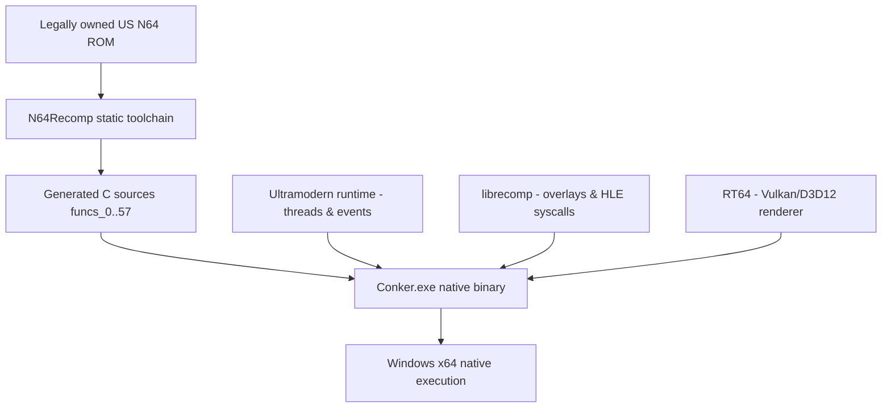

# Conker's Bad Fur Day — Native PC Port

<div align="center">


-orange?style=for-the-badge)


**English** · [Español](#español)

An experimental static-recompilation port of *Conker's Bad Fur Day* (N64) to native Windows, built on [N64Recomp](https://github.com/N64Recomp/N64Recomp), [N64ModernRuntime](https://github.com/Mr-Wiseguy/N64ModernRuntime) and the [RT64](https://github.com/rt64/rt64) Vulkan renderer.

</div>

---

## English

### Status, honestly

This project **builds and boots**, but is **not playable yet**. Rather than self-graded completion percentages, here's what has actually been verified by running the binary and reading the evidence it produced:

**Confirmed working**

- The Docker/MinGW toolchain produces a native `Conker.exe` that starts, loads and byte-swaps the US ROM, and passes its CIC check.
- The OS thread scheduler brings up all of the game's early threads (IDs 1, 3, 4, 20, 21) concurrently without deadlocking, and the dynamic overlay resolver dispatches into them correctly.
- RT64 initializes its Vulkan device, pipelines and render targets, and does draw real geometry: a sample run showed a sane viewport, active z-buffer/back-face culling, and thousands of triangles submitted with varied vertex indices.
- Input is wired end-to-end (keyboard → `get_input` callback → `osContGetReadData` → the recompiled game code) — confirmed by tracing the code path and by injecting real keystrokes into the running window.
- The actor tick engine (`func_15122AE0`, `func_15122C5C`, …) keeps executing continuously — it isn't stuck.

**The current blocker**

The game boots into its intro sequence, then the screen **stops updating** — it does not reach the "Nintendo" logo, the chainsaw title card, or the first playable menu the way a real N64/emulator run does. This was confirmed directly: a reference `mupen64plus` + Rice build of the same ROM (see [Reference emulator](#reference-emulator-for-comparison) below) renders the intro correctly, while our build freezes partway through it.

The root cause has been localized with instrumentation, not guessed at: the game keeps submitting new SP tasks (`osSpTaskStartGo` runs well past task #100 — both graphics and audio tasks), but RT64's internal `workloadId` permanently stops advancing around task #50 and never recovers, even after thousands of subsequent VI updates. There's no crash and no "malformed display list" abort, which rules out a runaway/misdecoded display list. This points to RT64's graphics task consumer thread getting stuck on an internal synchronization wait (most likely a Vulkan fence/semaphore tangled with the present thread) rather than a GBI parsing bug. See [Known Issues](#known-issues) for the full technical writeup.

### Subsystem breakdown

| Subsystem | State | Detail |
|---|:---:|---|
| MIPS static recompilation | ✅ Working | 58 translation units (`funcs_0.c`..`funcs_57.c`) compile and link. |
| OS thread scheduler | ✅ Working | Threads 1/3/4/20/21 start concurrently, Win32 TLS isolation, message queues. |
| Dynamic overlays | ✅ Working | Basic-block jump targets resolve to the right overlay function. |
| Actor tick engine | ✅ Working | Confirmed actively executing via instruction-level tracing, independent of the render stall. |
| RT64 Vulkan backend | 🟡 Partial | Initializes correctly and draws real geometry, but the task consumer stalls after ~50 SP tasks — see Known Issues. |
| F3DEXBG (Rare's custom microcode) | 🟡 In progress | Dedicated GBI module implemented and cross-checked field-by-field against GLideN64's `F3DEX2CBFD` reference (vertex format, Tri4 bit-packing, moveword/movemem all match); not yet proven correct end-to-end because rendering stalls before a full scene can be observed. |
| Audio | 🟡 In progress | SDL2 output wired, AI task queue draining; not fully verified against the render stall. |
| Input | ✅ Working | Verified wired end-to-end; irrelevant until the render stall is fixed, since nothing currently reads it back interactively. |

### Reference emulator (for comparison)

The project's Docker image can also run a real N64 emulator (`mupen64plus` + Rice) against the same ROM, headless, via `xvfb-run`, to produce ground-truth screenshots for comparison — this is how the render stall above was confirmed rather than assumed:

```bash
docker exec <container> bash -c \
  "apt-get install -y mupen64plus-ui-console mupen64plus-video-rice mupen64plus-audio-sdl mupen64plus-input-sdl mupen64plus-rsp-hle xvfb"

xvfb-run -a /usr/games/mupen64plus --noosd --gfx mupen64plus-video-rice.so \
  --audio dummy --rsp mupen64plus-rsp-hle.so --sshotdir ./shots \
  --testshots 60,300,600,1200,1800 baserom.us.z64
```

`--testshots` takes screenshots at the given frame numbers and exits — useful for pinning down exactly what a given point in the game is supposed to look like.

### Architecture



### Build & run

The toolchain (MinGW-w64 + Ninja + CMake) lives inside the project's Docker image, so no local compiler install is required.

```powershell
# One-time: build the toolchain image (see Dockerfile)
docker build -t conker .

# Full build (regenerates recompiled C sources from the ROM — see the warning below)
.\build_native.bat

# Incremental rebuild after editing C++ (RT64/RSP/GBI/main.cpp) — fast, and safe
docker run --rm -v "${PWD}:/conker" -w /conker conker bash -c "cd recomp && cmake --build build_win --target Conker"
Copy-Item recomp\build_win\Conker.exe .\Conker.exe -Force

# Run
.\Conker.exe .\baserom.us.z64
```

> **Important:** `build_native.bat` always reruns `N64Recomp` from scratch, which regenerates `recomp/src/recompiled/funcs_*.c`. Several of those files (`funcs_31/33/4/5/52/58/7/8.c`, especially `funcs_52.c`'s actor tick engine) carry hand patches that are committed directly into the generated sources but aren't encoded in `tools/recomp/patch_generated.py`. A full regen silently reverts them and has previously caused VI/framebuffer register corruption. **Prefer the incremental `cmake --build` command above** for day-to-day work, and if you do run the full pipeline, check `git diff -- recomp/src/recompiled/` before committing.

### Known Issues

**Render stall after ~50 SP tasks** (open, actively being investigated)

- Symptom: the game window stops updating partway through the intro sequence; input has no visible effect.
- `osSpTaskStartGo` keeps incrementing well past task #100 (game logic is alive and still submitting graphics + audio tasks).
- RT64's `workloadId` freezes around task #50 and never advances again, across thousands of subsequent VI presents.
- No "`[RT64] Aborting malformed display list`" safety-net message ever fires (that would print after 1,000,000 interpreted commands), which rules out a runaway/misdecoded display list looping forever.
- The VI's framebuffer address always resolves to a tracked `Framebuffer` (ruling out a ping-pong buffer address mismatch), and triangle submission looks structurally sane (viewport, z-buffer, culling all reasonable).
- Working theory: RT64's graphics task consumer thread (`WindowHandler::runTask` in `recomp/src/main.cpp`, driven by the SP task queue) is blocked on an internal synchronization primitive — most likely a Vulkan fence/semaphore shared with the present thread. This needs Vulkan-level tracing (validation layers, or instrumenting RT64's task queue wait conditions) to confirm.

If you pick this up: the diagnostic printfs added in `rt64_rsp.cpp` (`drawIndexedTri`), `rt64_rdp.cpp` (`setColorImage`) and `rt64_present_queue.cpp` (`threadPresent`) are already in place and rate-limited; re-running the build and grepping `conker_run.log` for `RT64 Present`, `RT64 RDP` and `osSpTaskStartGo` reproduces the evidence above.

### Project layout

```text
conker-master/
├── recomp/                  Native port and runtime
│   ├── N64ModernRuntime/    Ultramodern runtime and librecomp (HLE syscalls)
│   ├── rt64/                RT64 Vulkan/D3D12 graphics backend
│   └── src/recompiled/      Generated C sources (see the Known Issues warning above)
├── tools/                   N64Recomp, splat, and other recompilation tooling
├── build_native.bat         Full reproducible build (regenerates C sources)
└── README.md
```

### Credits

- Rare — original game and technology.
- [N64Recomp](https://github.com/N64Recomp/N64Recomp) — static recompilation toolchain.
- [N64ModernRuntime](https://github.com/Mr-Wiseguy/N64ModernRuntime) — Ultramodern runtime and librecomp.
- [RT64](https://github.com/rt64/rt64) — modern N64 renderer.
- [GLideN64](https://github.com/gonetz/GLideN64) — reference implementation of Conker's custom `F3DEX2CBFD` microcode, used to validate this port's F3DEXBG support.

### Legal notice

This repository must not contain the game ROM or copyrighted game assets. You must provide your own legally obtained copy.

---

## Español

### Estado, sin adornos

Este proyecto **compila y arranca**, pero **todavía no es jugable**. En vez de porcentajes autoevaluados, esto es lo que se verificó de verdad corriendo el binario y leyendo la evidencia que produjo:

**Confirmado funcionando**

- El toolchain Docker/MinGW genera un `Conker.exe` nativo que arranca, carga y hace el byte-swap de la ROM US, y pasa la verificación CIC.
- El planificador de hilos del SO levanta todos los hilos tempranos del juego (IDs 1, 3, 4, 20, 21) en paralelo sin bloquearse, y el resolutor de overlays dinámicos despacha correctamente hacia ellos.
- RT64 inicializa su dispositivo Vulkan, pipelines y render targets, y **sí** dibuja geometría real: una corrida de prueba mostró un viewport coherente, z-buffer y backface culling activos, y miles de triángulos enviados con índices variados.
- El input está conectado de punta a punta (teclado → callback `get_input` → `osContGetReadData` → código recompilado del juego) — confirmado tanto leyendo el código como inyectando teclas reales en la ventana corriendo.
- El motor de tick de actores (`func_15122AE0`, `func_15122C5C`, …) sigue ejecutándose de forma continua — no está trabado.

**El bloqueo actual**

El juego arranca su secuencia de intro y después la pantalla **deja de actualizarse** — no llega al logo de "Nintendo", ni a la pantalla de título con la motosierra, ni al primer menú jugable, como sí hace una corrida real en N64 o emulador. Esto se confirmó directamente: una build de referencia de `mupen64plus` + Rice corriendo la misma ROM (ver [Emulador de referencia](#emulador-de-referencia-para-comparar) abajo) renderiza la intro correctamente, mientras que nuestra build se congela a mitad de camino.

La causa raíz ya está localizada con instrumentación, no es una suposición: el juego sigue mandando nuevas tareas SP (`osSpTaskStartGo` sigue corriendo bien pasada la tarea #100 — tareas de gráficos y de audio), pero el `workloadId` interno de RT64 deja de avanzar para siempre alrededor de la tarea #50 y nunca se recupera, ni después de miles de actualizaciones de VI posteriores. No hay crash ni el aviso de "display list malformado", lo cual descarta un display list corrupto en loop. Esto apunta a que el thread consumidor de tareas gráficas de RT64 queda trabado en una espera de sincronización interna (lo más probable, un fence/semáforo de Vulkan cruzado con el thread de presentación), no un bug de parseo de GBI. Ver [Problemas conocidos](#problemas-conocidos) para el detalle técnico completo.

### Tabla de subsistemas

| Subsistema | Estado | Detalle |
|---|:---:|---|
| Recompilación estática MIPS | ✅ Funciona | 58 unidades de traducción (`funcs_0.c`..`funcs_57.c`) compilan y enlazan. |
| Planificador de hilos OS | ✅ Funciona | Hilos 1/3/4/20/21 arrancan en paralelo, aislamiento Win32 TLS, colas de mensajes. |
| Overlays dinámicos | ✅ Funciona | Los saltos a bloques básicos resuelven a la función de overlay correcta. |
| Motor de tick de actores | ✅ Funciona | Confirmado activo mediante trazado a nivel de instrucción, independiente del bloqueo de render. |
| Backend Vulkan RT64 | 🟡 Parcial | Inicializa correctamente y dibuja geometría real, pero el consumidor de tareas se traba después de ~50 tareas SP — ver Problemas Conocidos. |
| F3DEXBG (microcódigo custom de Rare) | 🟡 En progreso | Módulo GBI dedicado implementado y comparado campo por campo contra la referencia `F3DEX2CBFD` de GLideN64 (formato de vértice, empaquetado de bits de Tri4, moveword/movemem — todo coincide); no probado de punta a punta todavía porque el render se traba antes de poder observar una escena completa. |
| Audio | 🟡 En progreso | Salida SDL2 conectada, cola de tareas AI drenando; no verificado del todo contra el bloqueo de render. |
| Input | ✅ Funciona | Verificado de punta a punta; irrelevante hasta que se arregle el bloqueo de render, ya que nada lo lee de forma interactiva por ahora. |

### Emulador de referencia (para comparar)

La imagen Docker del proyecto también puede correr un emulador de N64 real (`mupen64plus` + Rice) contra la misma ROM, sin interfaz gráfica, vía `xvfb-run`, para generar capturas de referencia — así se confirmó el bloqueo de render de arriba en vez de asumirlo:

```bash
docker exec <container> bash -c \
  "apt-get install -y mupen64plus-ui-console mupen64plus-video-rice mupen64plus-audio-sdl mupen64plus-input-sdl mupen64plus-rsp-hle xvfb"

xvfb-run -a /usr/games/mupen64plus --noosd --gfx mupen64plus-video-rice.so \
  --audio dummy --rsp mupen64plus-rsp-hle.so --sshotdir ./shots \
  --testshots 60,300,600,1200,1800 baserom.us.z64
```

`--testshots` toma capturas en los números de frame indicados y termina — útil para saber exactamente cómo debería verse un punto dado del juego.

### Compilación y ejecución

El toolchain (MinGW-w64 + Ninja + CMake) vive dentro de la imagen Docker del proyecto, así que no hace falta instalar un compilador local.

```powershell
# Una sola vez: construir la imagen del toolchain (ver Dockerfile)
docker build -t conker .

# Build completo (regenera los fuentes C recompilados desde la ROM — ver la advertencia abajo)
.\build_native.bat

# Rebuild incremental después de editar C++ (RT64/RSP/GBI/main.cpp) — rápido y seguro
docker run --rm -v "${PWD}:/conker" -w /conker conker bash -c "cd recomp && cmake --build build_win --target Conker"
Copy-Item recomp\build_win\Conker.exe .\Conker.exe -Force

# Ejecutar
.\Conker.exe .\baserom.us.z64
```

> **Importante:** `build_native.bat` siempre vuelve a correr `N64Recomp` desde cero, lo que regenera `recomp/src/recompiled/funcs_*.c`. Varios de esos archivos (`funcs_31/33/4/5/52/58/7/8.c`, en especial el motor de actores en `funcs_52.c`) llevan parches hechos a mano que están commiteados directamente en los fuentes generados pero no están codificados en `tools/recomp/patch_generated.py`. Una regeneración completa los revierte en silencio, y ya causó corrupción de los registros VI/framebuffer una vez. **Preferí el comando incremental de `cmake --build` de arriba** para el trabajo del día a día, y si corrés el pipeline completo, revisá `git diff -- recomp/src/recompiled/` antes de commitear.

### Problemas conocidos

**Bloqueo de render después de ~50 tareas SP** (abierto, en investigación activa)

- Síntoma: la ventana del juego deja de actualizarse a mitad de la secuencia de intro; el input no tiene efecto visible.
- `osSpTaskStartGo` sigue incrementando bien pasada la tarea #100 (la lógica del juego está viva y sigue mandando tareas de gráficos y audio).
- El `workloadId` de RT64 se congela alrededor de la tarea #50 y nunca vuelve a avanzar, a través de miles de presentaciones VI posteriores.
- Nunca aparece el mensaje de seguridad "`[RT64] Aborting malformed display list`" (que imprimiría después de 1.000.000 de comandos interpretados), lo cual descarta un display list corrupto en loop infinito.
- La dirección de framebuffer del VI siempre resuelve a un `Framebuffer` rastreado (descartando un desajuste de dirección entre los buffers ping-pong), y el envío de triángulos se ve estructuralmente sano (viewport, z-buffer, culling, todo razonable).
- Teoría de trabajo: el thread consumidor de tareas gráficas de RT64 (`WindowHandler::runTask` en `recomp/src/main.cpp`, alimentado por la cola de tareas SP) está bloqueado en una primitiva de sincronización interna — lo más probable, un fence/semáforo de Vulkan compartido con el thread de presentación. Hace falta trazado a nivel Vulkan (validation layers, o instrumentar las condiciones de espera de la cola de tareas de RT64) para confirmarlo.

Si retomás esto: los `printf` de diagnóstico agregados en `rt64_rsp.cpp` (`drawIndexedTri`), `rt64_rdp.cpp` (`setColorImage`) y `rt64_present_queue.cpp` (`threadPresent`) ya están puestos y limitados en frecuencia; volver a correr el build y buscar `RT64 Present`, `RT64 RDP` y `osSpTaskStartGo` en `conker_run.log` reproduce la evidencia de arriba.

### Estructura del proyecto

```text
conker-master/
├── recomp/                  Port nativo y runtime
│   ├── N64ModernRuntime/    Runtime Ultramodern y librecomp (syscalls HLE)
│   ├── rt64/                Backend gráfico Vulkan/D3D12 RT64
│   └── src/recompiled/      Fuentes C generados (ver la advertencia en Problemas Conocidos)
├── tools/                   N64Recomp, splat, y otras herramientas de recompilación
├── build_native.bat         Build completo reproducible (regenera los fuentes C)
└── README.md
```

### Créditos

- Rare — juego y tecnología originales.
- [N64Recomp](https://github.com/N64Recomp/N64Recomp) — toolchain de recompilación estática.
- [N64ModernRuntime](https://github.com/Mr-Wiseguy/N64ModernRuntime) — runtime Ultramodern y librecomp.
- [RT64](https://github.com/rt64/rt64) — renderizador moderno para N64.
- [GLideN64](https://github.com/gonetz/GLideN64) — implementación de referencia del microcódigo custom `F3DEX2CBFD` de Conker, usada para validar el soporte F3DEXBG de este port.

### Aviso legal

Este repositorio no debe contener la ROM ni recursos con copyright del juego. Debés proporcionar tu propia copia obtenida legalmente.
