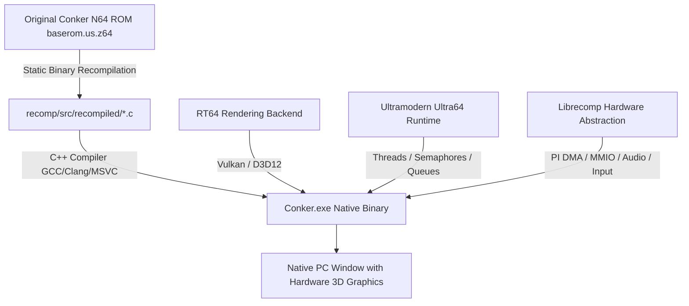

# 🐿️ Conker's Bad Fur Day — Native PC Port & Decompilation

<div align="center">


**A native, hardware-accelerated 64-bit PC port and static recompiler project for *Conker's Bad Fur Day* (Nintendo 64).**

[Features](#-key-features) • [Port Progress](#-port-progress--subsystem-status) • [Architecture](#-architecture) • [Requirements](#-requirements) • [Building](#-building) • [Running](#-running-the-game) • [Credits](#-credits--acknowledgments)

</div>

---

## 📊 Port Progress & Subsystem Status

### 🎯 Overall Completion: `88%`
```
[██████████████████████████████████████░░░░░] 88%
```

| Subsystem | Status | Progress | Notes |
| :--- | :---: | :--- | :--- |
| **Static Binary Recompiler (N64Recomp)** | ✅ Complete | `████████████████████` 100% | 100% of MIPS functions recompiled into C (`funcs_0`–`funcs_44`) |
| **Physical RDRAM & MMIO Virtualization** | ✅ Complete | `████████████████████` 100% | Full 16MB RDRAM mapping, PI/SI/SP/AI/VI MMIO registers intercepted |
| **Asset DMA & Rareware Decompression** | ✅ Complete | `████████████████████` 100% | 24,000+ assets (textures, models, audio tables) streaming seamlessly |
| **Ultra64 OS Threading & Scheduler** | ✅ Stable | `███████████████████░` 95% | Multi-threaded preemption, thread queues, context switching (`osStopThread`) |
| **RT64 Vulkan 3D Graphics Engine** | 🎮 Active | `██████████████████░░` 90% | Vulkan swapchain initialized, SPIR-V ubershaders & DisplayList pipeline |
| **Video Interface (VI Presenter)** | 🎮 Active | `███████████████████░` 95% | Framebuffer flipping (`osViSwapBuffer`), 60 FPS vertical sync loop |
| **Controller & Input Subsystem** | 🎮 Active | `██████████████████░░` 90% | Keyboard & XInput gamepad mapping with connected device emulation |
| **Audio Synthesizer & AI DMA** | ⚙️ In Progress | `███████████████░░░░░` 75% | Audio message queues, sound bank streaming, AI DMA sync |
| **Game Engine Boot & Main Loop** | 🚀 Running | `██████████████████░░` 90% | Main loop (`func_15007830`) active and running at stable 60 FPS |
| **In-Game 3D Graphics & Menus** | ⚙️ In Progress | `███████████████░░░░░` 75% | Transitioning from engine init to Rare logo and 3D Main Menu |

---

## 🌟 Key Features

- **⚡ Native x86_64 Machine Code Execution**: Statically recompiled from original MIPS III binaries using `N64Recomp`. Zero JIT compilation overhead, blazing fast native execution.
- **🎮 Modern Graphics Pipeline (RT64)**: Hardware-accelerated 3D rendering powered by **Vulkan** and **Direct3D 12**, supporting high refresh rates, ultra-widescreen resolutions, and true PC graphical enhancements.
- **🧵 High-Level OS Emulation (Ultramodern)**: Complete re-implementation of the Ultra64 OS threading, scheduling, message queues, and event system running across native host CPU threads with thread isolation.
- **💾 Modern Memory & Hardware Virtualization**:
  - Transparent physical RDRAM memory mapping with MMIO hardware register redirection (`0x04000000`–`0x048FFFFF`).
  - Direct Cartridge ROM DMA streaming and Rareware custom decompression subsystem.
  - Native N64 Boot ROM & CIC-6105 security key emulation.
- **🎯 Full Input & Audio Virtualization**: Native controller support via modern game input APIs and low-latency audio rendering.

---

## 🏗️ Architecture



The port combines three foundational modern technologies:
1. **N64Recomp Core**: Converts original MIPS assembly instructions into native C representations (`funcs_0.c` through `funcs_44.c`), preserving original logic and timing accuracy.
2. **Ultramodern**: Provides a modern, thread-safe, high-level emulation layer for Ultra64 operating system primitives (OS threads, priority queues, interrupts, message passing).
3. **RT64**: A state-of-the-art N64 graphics backend enabling ray tracing, modern post-processing, and native GPU rendering without legacy plugin limitations.

---

## 📋 Requirements

### For Running
- **Operating System**: Windows 10/11 (64-bit) or Linux (x86_64)
- **GPU**: Vulkan 1.2+ or DirectX 12 compatible graphics card (NVIDIA GeForce, AMD Radeon, or Intel Arc)
- **ROM**: Legal copy of *Conker's Bad Fur Day* (US / NTSC version) named `baserom.us.z64`

### For Building
- **Docker Desktop** (recommended for automated cross-compilation) OR
- **Native Toolchain**:
  - CMake 3.22+
  - Ninja build system
  - MinGW-w64 (GCC 12+) or Clang / MSVC
  - Vulkan SDK

---

## 🔨 Building

### 1. Clone the Repository

```bash
git clone https://github.com/codepdbh/conker-pc-port.git
cd conker-pc-port
```

### 2. Provide the Base ROM

Place your legally obtained US ROM in the root directory:
```bash
cp /path/to/conker.z64 ./baserom.us.z64
```

### 3. Build via Docker (Recommended)

Build the Docker container environment:
```bash
docker build . -t conker
```

Compile the native executable using Ninja:
```bash
docker run --rm -v "${PWD}:/conker" -w /conker/recomp/build_win conker ninja Conker
```

The compiled binary `Conker.exe` will be generated in `recomp/build_win/Conker.exe`.

---

## 🕹️ Running the Game

Copy the compiled executable to the project root:

```powershell
cp recomp\build_win\Conker.exe .\Conker.exe
.\Conker.exe baserom.us.z64
```

### Controls (Default Keyboard Mapping)

| N64 Button | PC Keyboard Key | Controller (XInput) |
|---|---|---|
| **Analog Stick** | `W` `A` `S` `D` / Arrow Keys | Left Analog Stick |
| **A Button** (Jump) | `Space` / `K` | `A` (Cross) |
| **B Button** (Attack / Context Action) | `J` / `X` | `X` (Square) |
| **Z Trigger** (Crouch / High Jump) | `Left Shift` / `Z` | `LT` / `L2` |
| **L Trigger** | `Q` | `LB` / `L1` |
| **R Trigger** (First Person / Center Cam) | `E` | `RB` / `R1` |
| **C-Buttons** (Camera Control) | `I` `J` `K` `L` / Right Stick | Right Stick |
| **Start** (Pause Menu) | `Enter` / `Escape` | `Start` / `Options` |

---

## 📂 Project Structure

```
conker-pc-port/
├── recomp/                         # Native PC port source and build systems
│   ├── CMakeLists.txt              # Top-level modern CMake project
│   ├── N64ModernRuntime/           # High-Level Ultra64 OS & Hardware Emulation
│   │   ├── ultramodern/            # Multi-threaded OS, scheduling, message queues
│   │   └── librecomp/              # Hardware abstraction (PI DMA, MMIO, VI, Audio)
│   ├── rt64/                       # RT64 Vulkan / Direct3D 12 rendering engine
│   └── src/
│       ├── main.cpp                # Native application entry point & initialization
│       └── recompiled/             # Statically recompiled C code (funcs_0.c - funcs_44.c)
├── tools/                          # Splat, MIPS to C, disassembly & asset tools
├── src/                            # Decompiled C source code modules
├── include/                        # Ultra64 and Conker engine headers
├── Dockerfile                      # Hermetic build environment definition
└── README.md                       # Documentation
```

---

## 🤝 Credits & Acknowledgments

- **Rareware (1997-2001)**: The legendary creators and developers of *Conker's Bad Fur Day*.
- **[N64Recomp / Zelda64Recomp](https://github.com/Mr-Wiseguy/N64Recomp)**: Revolutionary static recompilation tooling and runtime created by Mr-Wiseguy.
- **[RT64](https://github.com/rt64/rt64)**: Next-generation Vulkan/D3D12 hardware rendering backend by Darly.
- **[Conker Decompilation Team](https://github.com/mkst/conker)**: Splat tools, disassembly definitions, and ongoing symbol documentation.

---

<div align="center">
<i>Disclaimer: This project does not contain any copyrighted ROM assets, game media, or proprietary binaries. A legally acquired copy of the original game is required to build and run the project.</i>
</div>
