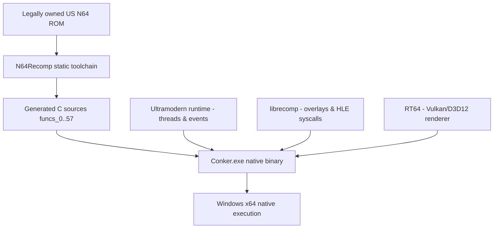

# Conker's Bad Fur Day — Native PC Port

<div align="center">


-orange?style=for-the-badge)


**English** · [Español](#español)

An experimental static-recompilation port of *Conker's Bad Fur Day* (N64) to native Windows, built on [N64Recomp](https://github.com/N64Recomp/N64Recomp), [N64ModernRuntime](https://github.com/Mr-Wiseguy/N64ModernRuntime) and the [RT64](https://github.com/rt64/rt64) Vulkan renderer.

</div>

---

## English

### Status, honestly

This project **builds and boots**, but is **not playable yet**. Rather than self-graded completion percentages, here's what has actually been verified by running the binary and reading the evidence it produced:

**Confirmed working**

- The Docker/MinGW toolchain produces a native `Conker.exe` that starts, loads and byte-swaps the US ROM, and passes its CIC check.
- The OS thread scheduler brings up all of the game's early threads (IDs 1, 3, 4, 20, 21) concurrently without deadlocking, and the dynamic overlay resolver dispatches into them correctly.
- RT64 initializes its Vulkan device, pipelines and render targets, and does draw real geometry: a sample run showed a sane viewport, active z-buffer/back-face culling, and thousands of triangles submitted with varied vertex indices.
- Input is wired end-to-end (keyboard → `get_input` callback → `osContGetReadData` → the recompiled game code) — confirmed by tracing the code path and by injecting real keystrokes into the running window.
- The actor tick engine (`func_15122AE0`, `func_15122C5C`, …) keeps executing continuously — it isn't stuck.

**The current blocker**

The game boots into its intro sequence, then the screen **stops updating** — it does not reach the "Nintendo" logo, the chainsaw title card, or the first playable menu the way a real N64/emulator run does. This was confirmed directly: a reference `mupen64plus` + Rice build of the same ROM (see [Reference emulator](#reference-emulator-for-comparison) below) renders the intro correctly, while our build freezes partway through it.

The root cause is **not** in the renderer — that was the first, wrong hypothesis. A thread-level watchdog caught one specific game thread spinning forever in recompiled game code, which traced back to a chain of four unbounded loops in the text/asset decoding subsystem, one of which turned out to be the heap allocator walking a tree that earlier corruption had turned into a cycle. All four are now bounded, which turns the silent permanent freeze into several minutes of continued execution followed by a clean, logged crash — real progress, but not yet a fix. See [Known Issues](#known-issues) for the full writeup and the concrete next step.

### Subsystem breakdown

| Subsystem | State | Detail |
|---|:---:|---|
| MIPS static recompilation | ✅ Working | 58 translation units (`funcs_0.c`..`funcs_57.c`) compile and link. |
| OS thread scheduler | ✅ Working | Threads 1/3/4/20/21 start concurrently, Win32 TLS isolation, message queues. |
| Dynamic overlays | ✅ Working | Basic-block jump targets resolve to the right overlay function. |
| Actor tick engine | ✅ Working | Confirmed actively executing via instruction-level tracing, independent of the render stall. |
| RT64 Vulkan backend | 🟡 Partial | Initializes correctly and draws real geometry; not itself at fault for the current stall (see Known Issues) but unproven past ~50 processed tasks. |
| F3DEXBG (Rare's custom microcode) | 🟡 In progress | Dedicated GBI module implemented and cross-checked field-by-field against GLideN64's `F3DEX2CBFD` reference (vertex format, Tri4 bit-packing, moveword/movemem all match); not yet proven correct end-to-end because rendering stalls before a full scene can be observed. |
| Audio | 🟡 In progress | SDL2 output wired, AI task queue draining; not fully verified against the render stall. |
| Input | ✅ Working | Verified wired end-to-end; irrelevant until the render stall is fixed, since nothing currently reads it back interactively. |

### Reference emulator (for comparison)

The project's Docker image can also run a real N64 emulator (`mupen64plus` + Rice) against the same ROM, headless, via `xvfb-run`, to produce ground-truth screenshots for comparison — this is how the render stall above was confirmed rather than assumed:

```bash
docker exec <container> bash -c \
  "apt-get install -y mupen64plus-ui-console mupen64plus-video-rice mupen64plus-audio-sdl mupen64plus-input-sdl mupen64plus-rsp-hle xvfb"

xvfb-run -a /usr/games/mupen64plus --noosd --gfx mupen64plus-video-rice.so \
  --audio dummy --rsp mupen64plus-rsp-hle.so --sshotdir ./shots \
  --testshots 60,300,600,1200,1800 baserom.us.z64
```

`--testshots` takes screenshots at the given frame numbers and exits — useful for pinning down exactly what a given point in the game is supposed to look like.

### Architecture



### Build & run

The toolchain (MinGW-w64 + Ninja + CMake) lives inside the project's Docker image, so no local compiler install is required.

```powershell
# One-time: build the toolchain image (see Dockerfile)
docker build -t conker .

# Full build (regenerates recompiled C sources from the ROM — see the warning below)
.\build_native.bat

# Incremental rebuild after editing C++ (RT64/RSP/GBI/main.cpp) — fast, and safe
docker run --rm -v "${PWD}:/conker" -w /conker conker bash -c "cd recomp && cmake --build build_win --target Conker"
Copy-Item recomp\build_win\Conker.exe .\Conker.exe -Force

# Run
.\Conker.exe .\baserom.us.z64
```

> **Important:** `build_native.bat` always reruns `N64Recomp` from scratch, which regenerates `recomp/src/recompiled/funcs_*.c`. Several of those files (`funcs_31/33/4/5/52/58/7/8.c`, especially `funcs_52.c`'s actor tick engine) carry hand patches that are committed directly into the generated sources but aren't encoded in `tools/recomp/patch_generated.py`. A full regen silently reverts them and has previously caused VI/framebuffer register corruption. **Prefer the incremental `cmake --build` command above** for day-to-day work, and if you do run the full pipeline, check `git diff -- recomp/src/recompiled/` before committing.

### Known Issues

**Root cause found and localized to a specific game-code subsystem: a corrupted heap feeding runaway loops in text/asset decoding** (four hangs fixed so far; a deeper crash remains — open)

An earlier version of this README diagnosed the render stall as an RT64/Vulkan synchronization issue. That was wrong, and disproven with hard evidence: a Windows thread-suspend-and-sample watchdog (`dump_all_thread_rips` in `recomp/src/main.cpp`, fires automatically ~15s and ~25s after boot, dumps every named thread's instruction pointer to stderr) showed every RT64/present/audio/VI thread correctly parked in an OS wait — except one game thread ("Game Thread 3"), which was sitting at the *exact same instruction* across both samples. That is a real infinite loop in **recompiled game code**, not an engine synchronization bug.

Resolving that address with `addr2line` against a `-g` debug build (see the incremental-build note above; add `-DCMAKE_CXX_FLAGS=-g -DCMAKE_C_FLAGS=-g` to a separate build dir to get one) and reading the surrounding recompiled C led to a **chain of four distinct unbounded loops**, fixed in order as each one unblocked the next:

1. `func_1503D368` (`recomp/src/recompiled/funcs_42.c`) — scans forward through a buffer for a `0xDF` string terminator. Real hardware/reference emulation always finds it; our build sometimes doesn't, because whatever it's scanning wasn't produced correctly, and the scan runs off into RDRAM forever.
2. `func_10006E00` (`recomp/src/recompiled/funcs_33.c`) — a bit-oriented (Huffman/LZ-style) decoder for the same text/asset system. Its inner "copy N literal bytes to the output" loop walks to a computed end address that, with bad input, is never reached — and worse, it *writes* a byte on every iteration, so capping the iteration count (an earlier version of this fix) still corrupted up to 4096 bytes of unrelated memory per call. The current fix validates the copy span **before** writing anything and skips the copy entirely if it's not sane, instead of partially executing a corrupt copy.
3. Two per-entry loops in the decoder's caller (`recomp/src/recompiled/funcs_22.c`, around `L_1503D0E8`/`L_1503D14C`) that call functions 1 and 2 once per list entry, bounded by a count read from the same suspect data — capped directly.
4. `func_10004074` (`recomp/src/recompiled/funcs_54.c`) — this one was a surprise: it's the **heap allocator's `free()`**, walking a free-block tree to find where to (re)insert a freed block. With the first three loops merely capped (not validated), they still wrote enough garbage to **corrupt the heap's free-list tree into a cycle**, which this function then walked forever. Confirmed by a dedicated warning that fires when the walk exceeds 10,000 steps.

All four now have safety nets (rate-limited one-shot `fprintf(stderr, "[Conker Warning] ...")` messages plus either a capped iteration count or, for #2, a pre-validated skip) and are committed directly into the generated sources — see the `patch_generated.py` warning above for why a full regen would silently lose them.

**What this gets you today:** the game no longer hangs *silently* forever at task #50 the instant it hits this corrupted data. It keeps running for several minutes, still processing input/audio/VI on schedule, before the process currently ends in a clean, logged `std::terminate` (`[CRASH] No active exception`) rather than an invisible freeze — a crash with a stack trace and a known trigger is strictly more debuggable than a silent hang, but it is **not yet a fix that reaches gameplay**.

**What's still open, and the real next step:** these four fixes treat symptoms of one underlying problem — something writes bad data into memory that the text/asset decoder and, transitively, the heap depend on being correct. The next session should not add a fifth loop guard when a new one is found (tightening the caps was tried and made things *worse* — see the git history around this change for a documented regression where a too-small cap truncated a legitimate large decode during early asset loading, which is why the caps you'll find in the source are more generous than strictly necessary). Instead: use the [reference emulator](#reference-emulator-for-comparison) to dump mupen64plus's RDRAM at the equivalent point and diff it against ours, or trace the DMA/overlay loads feeding this specific text/asset table, to find where the *real* corruption is written — not just where it's read.

If you pick this up, the tools are already in place: the thread-RIP watchdog in `main.cpp`, the `-g` build recipe above, and the `[Conker Warning]` messages that fire at each of the four points, plus the still-present RT64-side diagnostics (`rt64_rsp.cpp`'s `drawIndexedTri`, `rt64_rdp.cpp`'s `setColorImage`, `rt64_present_queue.cpp`'s `threadPresent`) from the earlier (incorrect) investigation, which remain useful for confirming the renderer itself isn't also at fault.

### Project layout

```text
conker-master/
├── recomp/                  Native port and runtime
│   ├── N64ModernRuntime/    Ultramodern runtime and librecomp (HLE syscalls)
│   ├── rt64/                RT64 Vulkan/D3D12 graphics backend
│   └── src/recompiled/      Generated C sources (see the Known Issues warning above)
├── tools/                   N64Recomp, splat, and other recompilation tooling
├── build_native.bat         Full reproducible build (regenerates C sources)
└── README.md
```

### Credits

- Rare — original game and technology.
- [N64Recomp](https://github.com/N64Recomp/N64Recomp) — static recompilation toolchain.
- [N64ModernRuntime](https://github.com/Mr-Wiseguy/N64ModernRuntime) — Ultramodern runtime and librecomp.
- [RT64](https://github.com/rt64/rt64) — modern N64 renderer.
- [GLideN64](https://github.com/gonetz/GLideN64) — reference implementation of Conker's custom `F3DEX2CBFD` microcode, used to validate this port's F3DEXBG support.

### Legal notice

This repository must not contain the game ROM or copyrighted game assets. You must provide your own legally obtained copy.

---

## Español

### Estado, sin adornos

Este proyecto **compila y arranca**, pero **todavía no es jugable**. En vez de porcentajes autoevaluados, esto es lo que se verificó de verdad corriendo el binario y leyendo la evidencia que produjo:

**Confirmado funcionando**

- El toolchain Docker/MinGW genera un `Conker.exe` nativo que arranca, carga y hace el byte-swap de la ROM US, y pasa la verificación CIC.
- El planificador de hilos del SO levanta todos los hilos tempranos del juego (IDs 1, 3, 4, 20, 21) en paralelo sin bloquearse, y el resolutor de overlays dinámicos despacha correctamente hacia ellos.
- RT64 inicializa su dispositivo Vulkan, pipelines y render targets, y **sí** dibuja geometría real: una corrida de prueba mostró un viewport coherente, z-buffer y backface culling activos, y miles de triángulos enviados con índices variados.
- El input está conectado de punta a punta (teclado → callback `get_input` → `osContGetReadData` → código recompilado del juego) — confirmado tanto leyendo el código como inyectando teclas reales en la ventana corriendo.
- El motor de tick de actores (`func_15122AE0`, `func_15122C5C`, …) sigue ejecutándose de forma continua — no está trabado.

**El bloqueo actual**

El juego arranca su secuencia de intro y después la pantalla **deja de actualizarse** — no llega al logo de "Nintendo", ni a la pantalla de título con la motosierra, ni al primer menú jugable, como sí hace una corrida real en N64 o emulador. Esto se confirmó directamente: una build de referencia de `mupen64plus` + Rice corriendo la misma ROM (ver [Emulador de referencia](#emulador-de-referencia-para-comparar) abajo) renderiza la intro correctamente, mientras que nuestra build se congela a mitad de camino.

La causa raíz **no** está en el renderizador — esa fue la primera hipótesis, y estaba mal. Un watchdog a nivel de threads atrapó a un thread específico del juego girando para siempre en código del juego recompilado, lo cual se rastreó hasta una cadena de cuatro loops infinitos en el subsistema de decodificación de texto/assets, uno de los cuales resultó ser el asignador de memoria (heap) caminando un árbol que una corrupción anterior había convertido en un ciclo. Los cuatro ya están acotados, lo cual convierte el freeze silencioso permanente en varios minutos de ejecución continua seguidos de un crash limpio y logueado — progreso real, pero todavía no un fix. Ver [Problemas conocidos](#problemas-conocidos) para el detalle completo y el próximo paso concreto.

### Tabla de subsistemas

| Subsistema | Estado | Detalle |
|---|:---:|---|
| Recompilación estática MIPS | ✅ Funciona | 58 unidades de traducción (`funcs_0.c`..`funcs_57.c`) compilan y enlazan. |
| Planificador de hilos OS | ✅ Funciona | Hilos 1/3/4/20/21 arrancan en paralelo, aislamiento Win32 TLS, colas de mensajes. |
| Overlays dinámicos | ✅ Funciona | Los saltos a bloques básicos resuelven a la función de overlay correcta. |
| Motor de tick de actores | ✅ Funciona | Confirmado activo mediante trazado a nivel de instrucción, independiente del bloqueo de render. |
| Backend Vulkan RT64 | 🟡 Parcial | Inicializa correctamente y dibuja geometría real; no es el culpable del bloqueo actual (ver Problemas Conocidos) pero no está probado más allá de ~50 tareas procesadas. |
| F3DEXBG (microcódigo custom de Rare) | 🟡 En progreso | Módulo GBI dedicado implementado y comparado campo por campo contra la referencia `F3DEX2CBFD` de GLideN64 (formato de vértice, empaquetado de bits de Tri4, moveword/movemem — todo coincide); no probado de punta a punta todavía porque el render se traba antes de poder observar una escena completa. |
| Audio | 🟡 En progreso | Salida SDL2 conectada, cola de tareas AI drenando; no verificado del todo contra el bloqueo de render. |
| Input | ✅ Funciona | Verificado de punta a punta; irrelevante hasta que se arregle el bloqueo de render, ya que nada lo lee de forma interactiva por ahora. |

### Emulador de referencia (para comparar)

La imagen Docker del proyecto también puede correr un emulador de N64 real (`mupen64plus` + Rice) contra la misma ROM, sin interfaz gráfica, vía `xvfb-run`, para generar capturas de referencia — así se confirmó el bloqueo de render de arriba en vez de asumirlo:

```bash
docker exec <container> bash -c \
  "apt-get install -y mupen64plus-ui-console mupen64plus-video-rice mupen64plus-audio-sdl mupen64plus-input-sdl mupen64plus-rsp-hle xvfb"

xvfb-run -a /usr/games/mupen64plus --noosd --gfx mupen64plus-video-rice.so \
  --audio dummy --rsp mupen64plus-rsp-hle.so --sshotdir ./shots \
  --testshots 60,300,600,1200,1800 baserom.us.z64
```

`--testshots` toma capturas en los números de frame indicados y termina — útil para saber exactamente cómo debería verse un punto dado del juego.

### Compilación y ejecución

El toolchain (MinGW-w64 + Ninja + CMake) vive dentro de la imagen Docker del proyecto, así que no hace falta instalar un compilador local.

```powershell
# Una sola vez: construir la imagen del toolchain (ver Dockerfile)
docker build -t conker .

# Build completo (regenera los fuentes C recompilados desde la ROM — ver la advertencia abajo)
.\build_native.bat

# Rebuild incremental después de editar C++ (RT64/RSP/GBI/main.cpp) — rápido y seguro
docker run --rm -v "${PWD}:/conker" -w /conker conker bash -c "cd recomp && cmake --build build_win --target Conker"
Copy-Item recomp\build_win\Conker.exe .\Conker.exe -Force

# Ejecutar
.\Conker.exe .\baserom.us.z64
```

> **Importante:** `build_native.bat` siempre vuelve a correr `N64Recomp` desde cero, lo que regenera `recomp/src/recompiled/funcs_*.c`. Varios de esos archivos (`funcs_22/31/33/4/5/42/52/54/58/7/8.c`, en especial el motor de actores en `funcs_52.c` y las protecciones contra loops infinitos en `funcs_22/33/42/54.c` — ver Problemas Conocidos) llevan parches hechos a mano que están commiteados directamente en los fuentes generados pero no están codificados en `tools/recomp/patch_generated.py`. Una regeneración completa los revierte en silencio, y ya causó corrupción de los registros VI/framebuffer una vez. **Preferí el comando incremental de `cmake --build` de arriba** para el trabajo del día a día, y si corrés el pipeline completo, revisá `git diff -- recomp/src/recompiled/` antes de commitear.

### Problemas conocidos

**Causa raíz encontrada y localizada en un subsistema específico del código del juego: un heap corrupto que alimenta loops infinitos en la decodificación de texto/assets** (cuatro cuelgues arreglados hasta ahora; queda un crash de fondo — abierto)

Una versión anterior de este README diagnosticaba el bloqueo de render como un problema de sincronización RT64/Vulkan. Eso estaba mal, y se descartó con evidencia dura: un watchdog que suspende y muestrea todos los threads de Windows (`dump_all_thread_rips` en `recomp/src/main.cpp`, se dispara solo a los ~15s y ~25s del arranque, y vuelca el instruction pointer de cada thread nombrado a stderr) mostró que todos los threads de RT64/presentación/audio/VI estaban correctamente esperando en una primitiva del sistema operativo — excepto uno ("Game Thread 3"), que estaba parado en la *misma instrucción exacta* en ambas muestras. Eso es un loop infinito real en **código del juego recompilado**, no un bug de sincronización del engine.

Resolver esa dirección con `addr2line` contra un build de debug con `-g` (ver la nota de build incremental arriba; agregá `-DCMAKE_CXX_FLAGS=-g -DCMAKE_C_FLAGS=-g` en un directorio de build separado) y leer el C recompilado alrededor llevó a una **cadena de cuatro loops infinitos distintos**, arreglados en orden a medida que cada uno desbloqueaba el siguiente:

1. `func_1503D368` (`recomp/src/recompiled/funcs_42.c`) — escanea hacia adelante buscando un byte terminador `0xDF` en un buffer. El hardware real / la emulación de referencia siempre lo encuentran; nuestro build a veces no, porque lo que está escaneando no se generó correctamente, y el escaneo se va escaneando RDRAM para siempre.
2. `func_10006E00` (`recomp/src/recompiled/funcs_33.c`) — un decodificador orientado a bits (estilo Huffman/LZ) del mismo sistema de texto/assets. Su loop interno de "copiar N bytes literales a la salida" camina hasta una dirección de fin calculada que, con datos malos, nunca se alcanza — y peor, *escribe* un byte en cada iteración, así que limitar el conteo de iteraciones (una versión anterior de este fix) igual corrompía hasta 4096 bytes de memoria ajena por llamada. El fix actual valida el rango de la copia **antes** de escribir nada y se salta la copia entera si no es razonable, en vez de ejecutar parcialmente una copia corrupta.
3. Dos loops por-entrada en quien llama al decodificador (`recomp/src/recompiled/funcs_22.c`, alrededor de `L_1503D0E8`/`L_1503D14C`) que llaman a las funciones 1 y 2 una vez por cada entrada de una lista, acotados por un conteo leído de los mismos datos sospechosos — limitados directamente.
4. `func_10004074` (`recomp/src/recompiled/funcs_54.c`) — esta fue una sorpresa: es el **`free()` del asignador de memoria (heap)**, que camina un árbol de bloques libres para encontrar dónde (re)insertar un bloque liberado. Con los primeros tres loops solo limitados (no validados), igual escribían suficiente basura como para **corromper el árbol de free-list del heap y convertirlo en un ciclo**, que esta función después caminaba para siempre. Confirmado por una advertencia dedicada que se dispara cuando el recorrido supera los 10.000 pasos.

Los cuatro ahora tienen redes de seguridad (mensajes `fprintf(stderr, "[Conker Warning] ...")` que se disparan una sola vez y con frecuencia limitada, más un conteo de iteraciones acotado o, para el #2, un salto pre-validado) y están commiteados directamente en los fuentes generados — ver la advertencia de `patch_generated.py` arriba para entender por qué una regeneración completa los perdería en silencio.

**Lo que esto te da hoy:** el juego ya no se cuelga *en silencio* para siempre en la tarea #50 apenas toca estos datos corruptos. Sigue corriendo por varios minutos, sigue procesando input/audio/VI según lo previsto, antes de que el proceso termine actualmente en un `std::terminate` limpio y logueado (`[CRASH] No active exception`) en vez de un freeze invisible — un crash con stack trace y un disparador conocido es estrictamente más debuggeable que un cuelgue silencioso, pero **todavía no es un fix que llegue al gameplay**.

**Lo que sigue abierto, y el próximo paso real:** estos cuatro fixes tratan síntomas de un solo problema de fondo — algo escribe datos malos en memoria de los que depende (correctamente) el decodificador de texto/assets y, transitivamente, el heap. La próxima sesión NO debería agregar una quinta protección de loop cuando aparezca una nueva. Ajustar los límites hacia abajo se probó y empeoró las cosas (ver el historial de git alrededor de este cambio para una regresión documentada, donde un límite demasiado chico truncó una decodificación grande legítima durante la carga temprana de assets — por eso los límites que vas a encontrar en el código son más generosos de lo estrictamente necesario). En cambio: usá el [emulador de referencia](#emulador-de-referencia-para-comparar) para volcar la RDRAM de mupen64plus en el punto equivalente y compararla contra la nuestra, o rastreá las cargas DMA/overlay que alimentan esta tabla específica de texto/assets, para encontrar dónde se escribe la corrupción *real* — no solo dónde se lee.

Si retomás esto, las herramientas ya están puestas: el watchdog de RIP de threads en `main.cpp`, la receta de build con `-g` de arriba, y los mensajes `[Conker Warning]` que se disparan en cada uno de los cuatro puntos, más los diagnósticos del lado de RT64 que siguen presentes (`drawIndexedTri` en `rt64_rsp.cpp`, `setColorImage` en `rt64_rdp.cpp`, `threadPresent` en `rt64_present_queue.cpp`) de la investigación anterior (incorrecta), que siguen siendo útiles para confirmar que el renderizador en sí no también tiene la culpa.

### Estructura del proyecto

```text
conker-master/
├── recomp/                  Port nativo y runtime
│   ├── N64ModernRuntime/    Runtime Ultramodern y librecomp (syscalls HLE)
│   ├── rt64/                Backend gráfico Vulkan/D3D12 RT64
│   └── src/recompiled/      Fuentes C generados (ver la advertencia en Problemas Conocidos)
├── tools/                   N64Recomp, splat, y otras herramientas de recompilación
├── build_native.bat         Build completo reproducible (regenera los fuentes C)
└── README.md
```

### Créditos

- Rare — juego y tecnología originales.
- [N64Recomp](https://github.com/N64Recomp/N64Recomp) — toolchain de recompilación estática.
- [N64ModernRuntime](https://github.com/Mr-Wiseguy/N64ModernRuntime) — runtime Ultramodern y librecomp.
- [RT64](https://github.com/rt64/rt64) — renderizador moderno para N64.
- [GLideN64](https://github.com/gonetz/GLideN64) — implementación de referencia del microcódigo custom `F3DEX2CBFD` de Conker, usada para validar el soporte F3DEXBG de este port.

### Aviso legal

Este repositorio no debe contener la ROM ni recursos con copyright del juego. Debés proporcionar tu propia copia obtenida legalmente.
