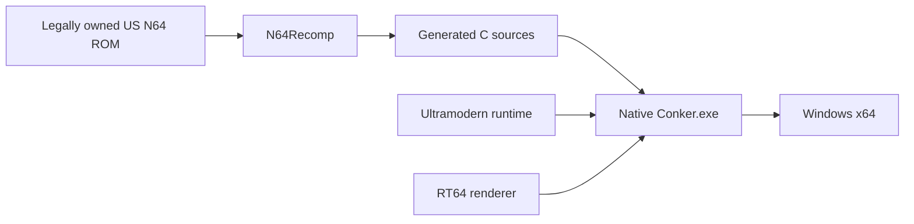

# Conker's Bad Fur Day — experimental native PC port

<div align="center">


**English** · [Español](#español)

An experimental static-recompilation port of *Conker's Bad Fur Day* for modern PCs.

> This is a development build. It is not yet playable and does not currently reach the menus or gameplay.

</div>

## English

### Current progress

Progress is tracked with reproducible milestones instead of a speculative overall percentage.

```text
Verified milestones: 4 / 10
[####------] 4 verified · 1 partial · 5 pending
```

| # | Milestone | Status | What has actually been verified |
|---:|---|:---:|---|
| 1 | Generate the recompiled C sources | Verified | N64Recomp produces `funcs_0.c` through `funcs_57.c`. |
| 2 | Build a native Windows executable | Verified | The Docker/MinGW build produces `Conker.exe`. |
| 3 | Load and start the original ROM | Verified | The US ROM loads, is byte-swapped when required, and enters the runtime. |
| 4 | Reach the first game frame | Verified | Threads, message queues and PI DMA advance far enough to submit the first graphics task. |
| 5 | Process the first display list safely | Partial | The bounded task returns SP/DP completion, but Conker's custom graphics microcode is incomplete. |
| 6 | Render stable consecutive frames | Pending | Continuous, correct presentation has not been demonstrated. |
| 7 | Implement Conker's `F3DEXBG` microcode | Pending | Custom vertices, packed `Tri4`, lighting and related commands still need RT64 support. |
| 8 | Validate controller input in-game | Pending | Host input has not been validated in a reachable game scene. |
| 9 | Validate audio output in-game | Pending | Audio synthesis and AI DMA have not been validated end to end. |
| 10 | Reach menus and playable gameplay | Pending | Neither menus nor gameplay are currently reachable. |

The count is deliberately conservative: “partial” does not count as complete. Update it only after recording a repeatable test.

### What works today

- Native x86-64 Windows cross-compilation.
- ROM loading and initial RDRAM/runtime setup.
- Enough Ultra64 threading, message-queue and PI DMA behavior to enter the main loop and construct the first frame.
- RT64 initialization and bounded display-list submission.

### Main blockers

- Correct RT64 support for Rare's custom `F3DEXBG.NoN` graphics microcode.
- Stable GPU resource creation and consecutive-frame presentation.
- Removal of remaining generated-code compatibility workarounds.
- End-to-end validation of video, input, audio, menus and gameplay.

### Architecture



The project combines N64Recomp for static MIPS-to-C translation, Ultramodern/librecomp for Ultra64 services, and RT64 for modern graphics processing.

### Requirements

- Windows 10 or 11, 64-bit. Other platforms are not currently verified.
- Docker Desktop for the reproducible cross-build.
- A Direct3D 12 or Vulkan-capable GPU.
- A legally obtained US/NTSC ROM named `baserom.us.z64`. The ROM is not included.

### Build and run

From PowerShell in the repository root:

```powershell
.\build_native.bat
.\Conker.exe .\baserom.us.z64
```

The script performs a clean Docker build and places `Conker.exe` in the repository root. Expect an experimental bring-up build, not a playable port.

Developers can set `CONKER_EXPERIMENTAL_F3DEX2=1` before launching to exercise the incomplete F3DEX2-compatible graphics path. It is disabled by default because Conker's custom microcode can currently produce invalid GPU workloads.

### Reporting progress

For each completed milestone, record the exact commit, build result, GPU and graphics API, last runtime stage, and a reproducible log or capture.

---

## Español

### Progreso actual

El progreso se mide mediante hitos reproducibles, no con un porcentaje general especulativo.

```text
Hitos verificados: 4 / 10
[####------] 4 verificados · 1 parcial · 5 pendientes
```

| # | Hito | Estado | Qué se ha comprobado realmente |
|---:|---|:---:|---|
| 1 | Generar el código C recompilado | Verificado | N64Recomp genera `funcs_0.c` a `funcs_57.c`. |
| 2 | Compilar un ejecutable nativo de Windows | Verificado | La compilación con Docker/MinGW produce `Conker.exe`. |
| 3 | Cargar e iniciar la ROM original | Verificado | La ROM estadounidense se carga, corrige su orden de bytes si hace falta y entra al runtime. |
| 4 | Alcanzar el primer fotograma del juego | Verificado | Los hilos, colas de mensajes y DMA de PI avanzan hasta enviar la primera tarea gráfica. |
| 5 | Procesar con seguridad la primera display list | Parcial | La tarea acotada devuelve SP/DP, pero el microcódigo gráfico de Conker está incompleto. |
| 6 | Renderizar fotogramas consecutivos estables | Pendiente | Aún no se ha demostrado una presentación continua y correcta. |
| 7 | Implementar el microcódigo `F3DEXBG` de Conker | Pendiente | Faltan vértices personalizados, `Tri4` empaquetado, iluminación y órdenes relacionadas en RT64. |
| 8 | Validar el mando dentro del juego | Pendiente | La entrada del host no se ha validado en una escena alcanzable. |
| 9 | Validar el audio dentro del juego | Pendiente | La síntesis y el DMA de AI no se han validado de extremo a extremo. |
| 10 | Alcanzar menús y una partida jugable | Pendiente | Actualmente no se llega a los menús ni al gameplay. |

El conteo es deliberadamente conservador: un hito “parcial” no cuenta como terminado. Solo debe actualizarse después de registrar una prueba repetible.

### Qué funciona hoy

- Compilación cruzada nativa para Windows x86-64.
- Carga de ROM y configuración inicial de RDRAM/runtime.
- Suficiente funcionamiento de hilos Ultra64, colas de mensajes y DMA de PI para entrar al bucle principal y construir el primer fotograma.
- Inicialización de RT64 y envío acotado de la primera display list.

### Bloqueos principales

- Soporte correcto en RT64 para el microcódigo personalizado `F3DEXBG.NoN` de Rare.
- Creación estable de recursos GPU y presentación de fotogramas consecutivos.
- Eliminar las soluciones temporales de compatibilidad del código generado.
- Validar de extremo a extremo vídeo, entrada, audio, menús y gameplay.

### Requisitos

- Windows 10 u 11 de 64 bits. Las demás plataformas aún no están verificadas.
- Docker Desktop para la compilación reproducible.
- GPU compatible con Direct3D 12 o Vulkan.
- Una ROM legal US/NTSC llamada `baserom.us.z64`. La ROM no está incluida.

### Compilar y ejecutar

Desde PowerShell, en la raíz del repositorio:

```powershell
.\build_native.bat
.\Conker.exe .\baserom.us.z64
```

El script realiza una compilación limpia dentro de Docker y coloca `Conker.exe` en la raíz. Es una versión experimental, no un port jugable.

Los desarrolladores pueden definir `CONKER_EXPERIMENTAL_F3DEX2=1` antes de ejecutar para probar la ruta gráfica incompleta compatible con F3DEX2. Está desactivada por defecto porque el microcódigo personalizado de Conker todavía puede producir cargas GPU no válidas.

### Cómo informar un avance

Para cada hito terminado, registra el commit exacto, resultado de compilación, GPU y API gráfica, última etapa alcanzada y un log o captura reproducible.

---

## Project layout / Estructura del proyecto

```text
conker-master/
├── recomp/                  Native port and runtime / Port y runtime nativos
│   ├── N64ModernRuntime/    Ultramodern and librecomp
│   ├── rt64/                Graphics backend / Backend gráfico
│   └── src/recompiled/      Generated C sources / Código C generado
├── tools/                   Recompilation tools / Herramientas
├── build_native.bat         Reproducible build / Compilación reproducible
└── README.md
```

## Credits / Créditos

- Rare — original game and technology / juego y tecnología originales.
- [N64Recomp](https://github.com/Mr-Wiseguy/N64Recomp) — static recompilation / recompilación estática.
- [RT64](https://github.com/rt64/rt64) — modern N64 renderer / renderizador moderno para N64.
- [Conker decompilation project](https://github.com/mkst/conker) — analysis and tooling / análisis y herramientas.

## Legal notice / Aviso legal

This repository must not contain the game ROM or copyrighted game assets. You must provide your own legally obtained copy.

Este repositorio no debe contener la ROM ni recursos con copyright del juego. Debes proporcionar tu propia copia obtenida legalmente.
