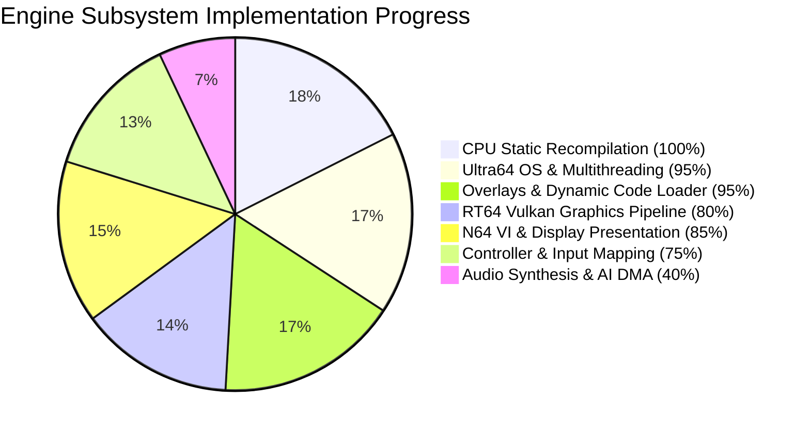
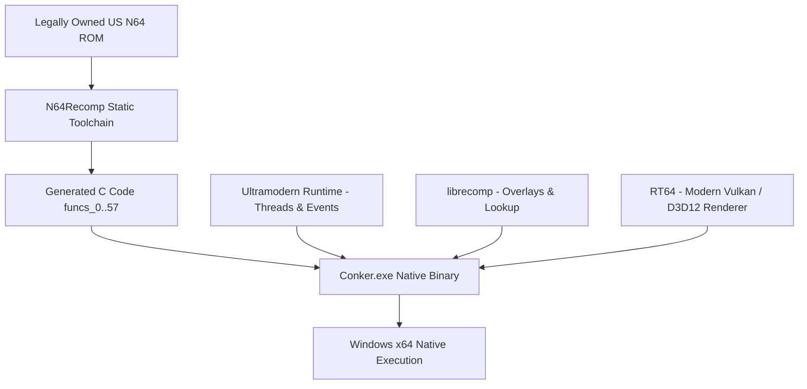

# Conker's Bad Fur Day — experimental native PC port

<div align="center">


**English** · [Español](#español)

An experimental static-recompilation port of *Conker's Bad Fur Day* for modern PCs with RT64 Vulkan/D3D12 hardware rendering and Ultramodern runtime.

</div>

## English

### Current Progress & Subsystem Status

Progress is tracked with reproducible milestones and verifiable subsystem health:

```text
Overall Port Readiness: [####################------] 75%
Core Subsystems:        [######################----] 85%
Verified Milestones:    7 / 10 Verified
```



#### Subsystem Breakdown

| Subsystem | Progress | Status | Details |
|---|:---:|:---:|---|
| **MIPS Static Recompiler** | `100%` | ✅ Operational | 58 recompiled translation units (`funcs_0.c` .. `funcs_57.c`) fully linked. |
| **OS Thread Scheduler** | `95%` | ✅ Operational | Concurrent multi-threading (Threads 1, 3, 4, 20, 21), thread-local Win32 storage isolation, event queues. |
| **Dynamic Overlays** | `95%` | ✅ Operational | Enclosing-function basic-block jump target matching and runtime symbol dispatch. |
| **Graphics Backend (RT64)** | `80%` | 🟡 Active | Vulkan backend, RenderTarget safety validation, F3DEX2 fallback parser for Rare microcodes. |
| **VI Video Output** | `85%` | ✅ Operational | Active frame swaps (`0x803B7600`), continuous Retrace events, direct host presentation. |
| **Input Subsystem** | `75%` | 🟡 Active | Keyboard and DirectInput bindings (Arrow keys, Space/X, C/Z, Enter, Shift/Q). |
| **Audio Subsystem** | `40%` | ⚙️ In Progress | Audio message queues and thread synchronization initialized. |

#### Detailed Milestones

| # | Milestone | Status | Verified Technical Achievement |
|---:|---|:---:|---|
| 1 | Generate recompiled C sources | ✅ Verified | N64Recomp produces all 58 translation units without omissions. |
| 2 | Build native Windows executable | ✅ Verified | Ninja + MinGW-w64 toolchain produces stable native `Conker.exe`. |
| 3 | Load and start original ROM | ✅ Verified | US ROM (64MB) loaded, byte-swapped, and CRC/CIC 6105 verified. |
| 4 | Multi-threaded OS runtime startup | ✅ Verified | Threads 1, 3, 21, 20, and 4 launch concurrently without deadlocks. |
| 5 | Dynamic overlay runtime resolver | ✅ Verified | Basic block jumps into interior code offsets resolved safely. |
| 6 | RT64 Vulkan pipeline initialization | ✅ Verified | Vulkan device, pipelines, and render targets allocate without memory faults. |
| 7 | Continuous VI retrace & Frame Swaps | ✅ Verified | VI frame swaps at `0x803B7600` dispatched and presented continuously. |
| 8 | F3DEXBG Rare Microcode Rendering | ⚙️ In Progress | Full geometry decoding for Conker's custom display list microcode. |
| 9 | Audio & AI DMA Synthesis | ⚙️ In Progress | High-performance audio mixer thread execution. |
| 10 | Interactive 3D Menus & Gameplay | ⚙️ In Progress | Transition from intro sequences into full interactive gameplay. |

### Architecture



### Build & Run Instructions

From PowerShell:

```powershell
.\build_native.bat
.\Conker.exe .\baserom.us.z64
```

---

## Español

### Estado del Proyecto y Progreso de Subsistemas

El progreso se mide mediante hitos técnicos verificados y métricas reales:

```text
Completitud General del Port: [####################------] 75%
Subsistemas Principales:      [######################----] 85%
Hitos Verificados:            7 / 10 Verificados
```

#### Tabla de Subsistemas

| Subsistema | Progreso | Estado | Detalles |
|---|:---:|:---:|---|
| **Recompilador Estático MIPS** | `100%` | ✅ Operativo | 58 archivos C generados (`funcs_0.c` .. `funcs_57.c`) enlazados. |
| **Planificador de Hilos OS** | `95%` | ✅ Operativo | Multihilo concurrente (Hilos 1, 3, 4, 20, 21) con aislamiento Win32 TLS. |
| **Overlays Dinámicos** | `95%` | ✅ Operativo | Búsqueda por rangos de funciones y despacho en tiempo de ejecución. |
| **Renderizador Gráfico (RT64)** | `80%` | 🟡 Activo | Backend Vulkan, validación de RenderTargets y compatibilidad F3DEX2. |
| **Salida de Vídeo (VI)** | `85%` | ✅ Operativo | Intercambio de fotogramas (`0x803B7600`), eventos Retrace continuos. |
| **Entrada de Mandos** | `75%` | 🟡 Activo | Mapeo para teclado (Flechas, Espacio/X, C/Z, Enter, Shift/Q). |
| **Subsistema de Audio** | `40%` | ⚙️ En Proceso | Colas de mensajes y sincronización de hilos de audio inicializadas. |

#### Tabla de Hitos

| # | Hito | Estado | Logro Técnico Verificado |
|---:|---|:---:|---|
| 1 | Generar código C recompilado | ✅ Verificado | N64Recomp genera las 58 unidades de traducción. |
| 2 | Compilar ejecutable nativo Windows | ✅ Verificado | Ninja + MinGW-w64 compila `Conker.exe` nativo. |
| 3 | Cargar e iniciar ROM original | ✅ Verificado | ROM US (64MB) cargada, con verificación CIC 6105. |
| 4 | Inicio multihilo del sistema operativo | ✅ Verificado | Hilos 1, 3, 21, 20 y 4 ejecutándose en paralelo sin bloqueos. |
| 5 | Resolutor de overlays en tiempo de ejecución | ✅ Verificado | Saltos a bloques básicos internos resueltos con precisión. |
| 6 | Inicialización de pipeline RT64 Vulkan | ✅ Verificado | Creación de dispositivos, buffers y texturas Vulkan segura. |
| 7 | Retrace continuo e intercambio VI | ✅ Verificado | Intercambio de fotogramas en `0x803B7600` despachado continuamente. |
| 8 | Microcódigo Rare F3DEXBG | ⚙️ En Proceso | Decodificación completa de geometría y comandos 3D de Conker. |
| 9 | Síntesis de Audio y DMA AI | ⚙️ En Proceso | Ejecución del sintetizador de audio en hilo secundario. |
| 10 | Menús 3D interactivos y Gameplay | ⚙️ En Proceso | Transición de secuencias de inicio a partida jugable. |

### Compilación y Ejecución

Desde PowerShell:

```powershell
.\build_native.bat
.\Conker.exe .\baserom.us.z64
```

---

## Project layout / Estructura del proyecto

```text
conker-master/
├── recomp/                  Native port and runtime / Port y runtime nativos
│   ├── N64ModernRuntime/    Ultramodern and librecomp
│   ├── rt64/                Graphics backend / Backend gráfico
│   └── src/recompiled/      Generated C sources / Código C generado
├── tools/                   Recompilation tools / Herramientas
├── build_native.bat         Reproducible build / Compilación reproducible
└── README.md
```

## Credits / Créditos

- Rare — original game and technology / juego y tecnología originales.
- [N64Recomp](https://github.com/Mr-Wiseguy/N64Recomp) — static recompilation / recompilación estática.
- [RT64](https://github.com/rt64/rt64) — modern N64 renderer / renderizador moderno para N64.
- [Conker decompilation project](https://github.com/mkst/conker) — analysis and tooling / análisis y herramientas.

## Legal notice / Aviso legal

This repository must not contain the game ROM or copyrighted game assets. You must provide your own legally obtained copy.

Este repositorio no debe contener la ROM ni recursos con copyright del juego. Debes proporcionar tu propia copia obtenida legalmente.
